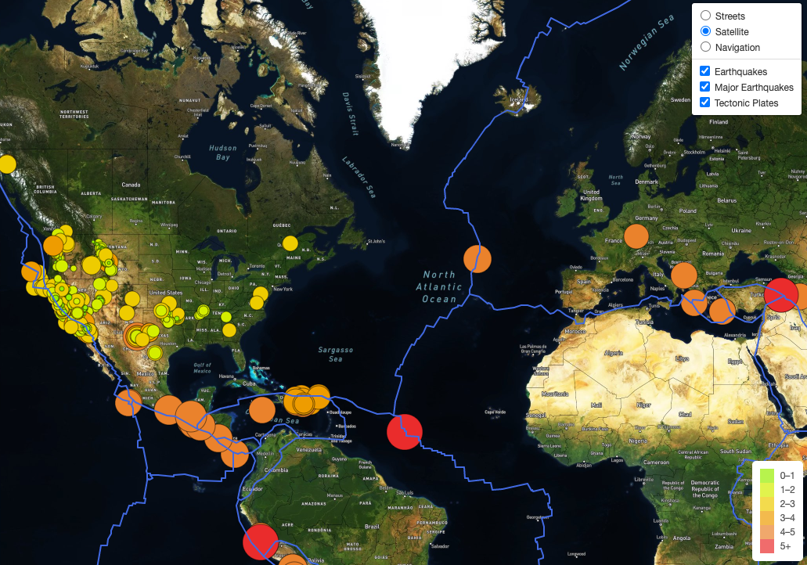

# Mapping Earthquakes
Traversing and retrieving GeoJSON data on earthquakes and tectonic plates from the US Geological Survey website using JavaScript and D3 and Leaflet libraries, and plotting the data on a Mapbox map through an API request.  

## Project Overview: 

## Tools:  
- Software:
- Dependencies: 
- API Data Sources: 

## Link to interactive map:
The interactive map is accessable through [this webpage.](https://npvandyke.github.io/Mapping_Earthquakes/) 

Questions? Comments? [Let's Connect!](https://www.linkedin.com/in/natalie-vandyke-npv/) 
